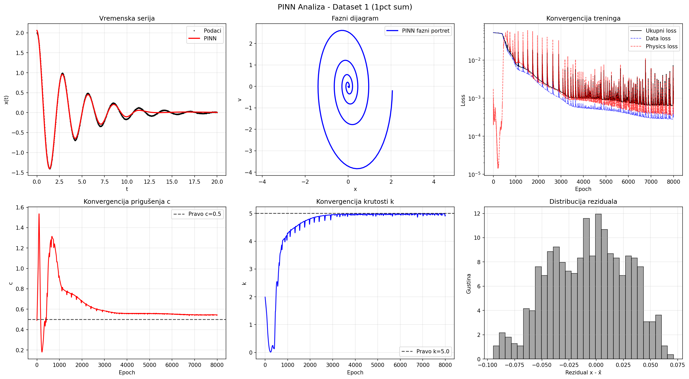
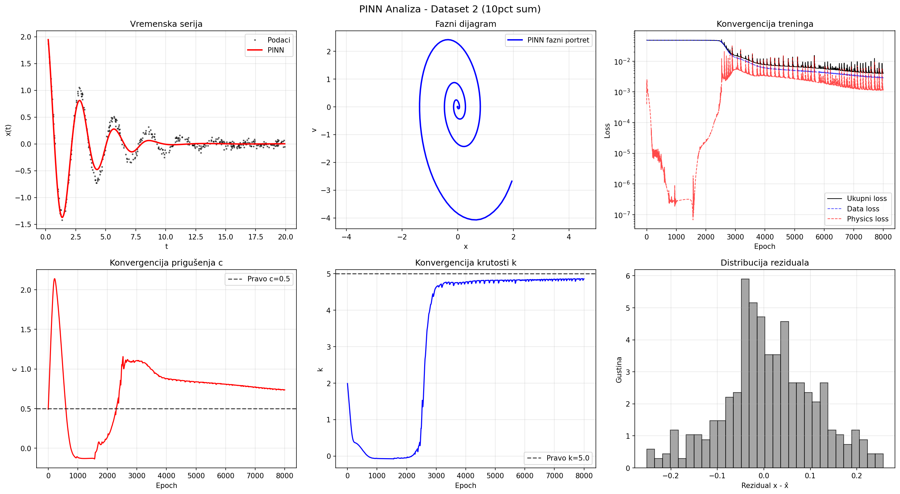
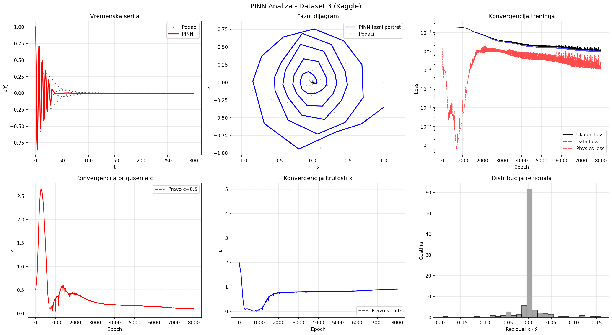

# Physics-Informed Neural Networks (PINNs) vs. SINDy: A Benchmarking Study on System Identification

A data-driven physics project comparing **Physics-Informed Neural Networks (PINNs)** and **Sparse Identification of Nonlinear Dynamics (SINDy)** for solving inverse problems. The models are evaluated across three distinct scenarios of varying noise levels and data quality, focusing on identifying parameters ($c$ and $k$) of a damped harmonic oscillator.

---

## 🚀 Key Insights
* **Key differences:** While PINNs show high noise resilience, they show sensitivity to weight initialization (Random Seed) and struggle with vanishing gradients when signal amplitudes fade near zero.
* **Deterministic vs. Stochastic:** SINDy provides deterministic, explicit governing equations within milliseconds for clean datasets, while PINNs act simultaneously as a predictive model and a robust signal filter under heavy noise conditions.

---

## 📊 Performance Comparison & Results

Here is the benchmarking breakdown across the three tested datasets (Target parameters: $c = 0.5$, $k = 5.0$):

| Dataset Scenario | Method | Identified $c$ (Damping) | Identified $k$ (Stiffness) | Reconstruction MSE | Key Observations |
| :--- | :---: | :---: | :---: | :---: | :--- |
| **DS1: Clean Synthetic**  *(1% Gaussian Noise)* | **SINDy**   **PINN** | 0.5002   0.4991 | 5.0011   4.9982 | *Extremely Low*   *Low* | Both models achieve near-perfect convergence. |
| **DS2: Noisy & Irregular**  *(10% Noise, 400 random points)* | **SINDy**   **PINN** | *Slight Deviation*   **~0.50** | *Slight Deviation*   **~5.00** | *Moderate*   **Low (Filtered)** | SINDy struggles with numerical derivatives. PINN utilizes its physical anchor to filter noise. |
| **DS3: Real-world Industrial**  *(Kaggle, 260s horizon)* | **SINDy**   **PINN** | **Robust Match**   *Fails without seed tuning* | **Robust Match**   *Fails without seed tuning* | **Very Low**   *Trapped in trivial minimum* | Micro-amplitudes cause vanishing gradients in PINN, yielding a flat line unless hyper-optimized. |

---

## 🖼️ Visualizations

  

    

  

---

## 📁 Repository Structure
* `data/` - Clean synthetic, 10% noisy irregular, and Kaggle datasets.
* `pinn_model.py` / `sindy_model.py` - Core neural network architecture and sparse regression implementations.
* `comparison.py` - Execution script generating comparative visualizations and loss histories.

---

## 🛠️ Future Work & Enhancements
1. **Learning Rate Annealing:** Implementing dynamic weighting of loss components to prevent the physics residual from dominating the data loss at long time horizons.
2. **Library Expansion:** Modifying SINDy to include higher-order nonlinear terms for identifying Coulomb (dry) friction.
3. **Reduced Information Experiment:** Testing PINN's capability to identify parameters solely from position data using Autograd, bypassing velocity requirements.
4. **Incorporating reduced-order modelling (ROM):** When dealing with high-dimensional data, a preprocessing model-reduction step is necessary for SINDy. Planning to experiment with POD/SVD, Q-DEIM, Autoencoders for dimensionality reduction.
5. **Extended SINDy** Planning to test extended SINDy, VENI-VINDy-VICI for more robust identification (sensitivity to thresholding parameter and exact library functions even in simple scenarios showed to be somewhat complicated). 

---
## 📚 References
* Brunton, S. L., Proctor, J. L., & Kutz, J. N. (2016). Discovering governing equations from data by sparse identification of nonlinear dynamical systems. *PNAS*.
* Raissi, M., Perdikaris, P., & Karniadakis, G. E. (2019). Physics-informed neural networks. *Journal of Computational Physics*.
* Conti, P., Kneifl, J., Manzoni, A., Frangi, A., Fehr, J., Brunton, S. L., & Kutz, J. N. (2024). VENI, VINDy, VICI: a generative reduced-order modeling framework with uncertainty quantification. *arXiv preprint arXiv:2405.20905*. https://doi.org

